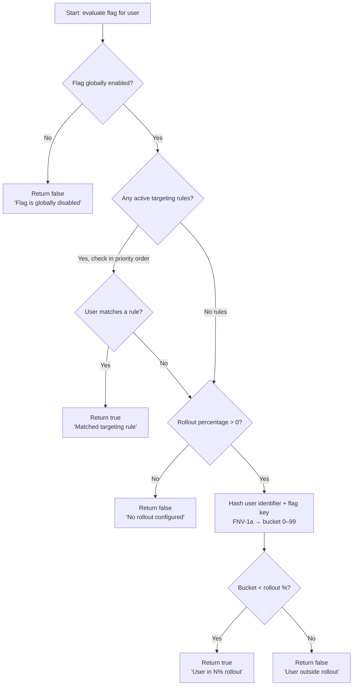

# Evaluation Algorithm

When your application calls `/sdk/v1/evaluate`, the service runs this algorithm for every flag in the requested environment. It is deterministic. The same user and flag always produce the same result given the same configuration.

## The algorithm

## Step by step

**Step 1: Global switch**

If `enabled = false`, return `false` immediately. No rules or rollout logic runs.

**Step 2: Targeting rules**

Active rules are sorted by `priority` descending. Each rule is evaluated against the user context:

- `user_id` — exact match against `context.user_id`
- `user_email` — exact match against `context.user_email`
- `email_domain` — suffix match against `context.user_email`

The first matching rule returns `true`. If no rules match, continue.

**Step 3: Rollout percentage**

The user is assigned to a bucket using FNV-1a hash of `"<flag_key>:<user_identifier>"`. The result is mapped to a number from 0 to 99.

- If the bucket number is less than the rollout percentage, return `true`
- Otherwise return `false`

The `user_identifier` is `user_id` if provided, otherwise `user_email`. The same user always lands in the same bucket across requests, servers, and restarts.

**Step 4: Default**

If `enabled = true` and `rollout_percentage` is `0` (or not set), the rollout block is skipped entirely and the flag returns `true` for everyone with reason `"Flag enabled globally"`. To disable a flag for all users, set `enabled` to `false`.

## Why FNV-1a

FNV-1a is fast, deterministic, and produces a uniform distribution across the 0–99 bucket range. It requires no external state. The hash is seeded with the flag key, so the same user lands in a different bucket for different flags. Gradual rollouts across multiple flags are independent of each other.

## The `reason` field

Every evaluation result includes a `reason` string:

| Result | Reason string |
|---|---|
| Global switch off | `"Flag is globally disabled"` |
| Rule match | `"Matched user_id targeting rule"` / `"Matched email_domain targeting rule"` etc. |
| In rollout bucket | `"User in 20% rollout"` |
| Outside rollout bucket | `"User not in 20% rollout"` |
| Enabled, no rollout | `"Flag enabled globally"` |

The reason is for debugging only. Branch on `enabled`, not `reason`.

## Evaluation latency

Evaluation is typically **under 10ms** end-to-end. The service fetches all flags for the environment in one query and all rules in a second batch query. Evaluation logic runs in memory. Evaluation logs are written asynchronously and never block the response.
