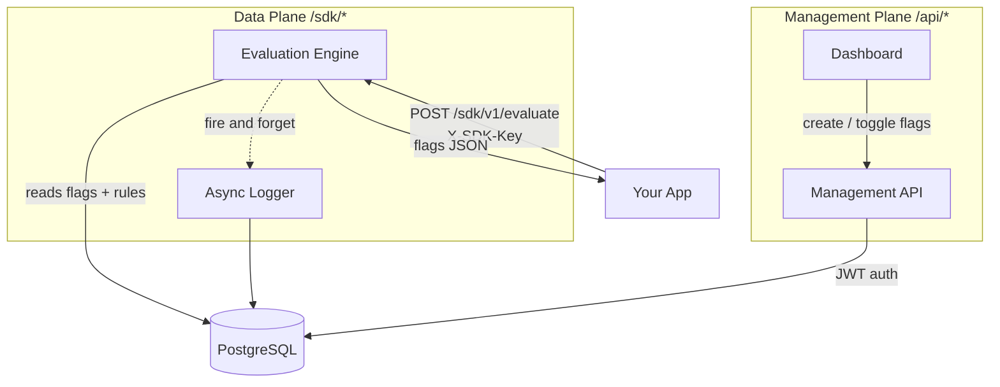

# Concepts

Understanding the data model makes everything else predictable. There are five building blocks.

## The data model

```
Account
└── Project (has one SDK key)
    └── Environment  (production / staging / custom)
        └── Feature Flag  (key, enabled, rollout %)
            └── Targeting Rule  (user_id / user_email / email_domain)
```

A **Project** is your application. It has one SDK key used to call the evaluate endpoint. When you create a project, `production` and `staging` environments are provisioned automatically.

An **Environment** scopes a set of flags. The same flag key can exist in production and staging with completely independent configurations. Enabling a flag in staging has no effect on production.

A **Feature Flag** is a named boolean switch inside an environment. It has a key your application code references, a global on/off switch, and an optional rollout percentage.

A **Targeting Rule** enables a flag for specific users before the rollout logic runs. Rules have a type (`user_id`, `user_email`, or `email_domain`), a value to match, and a priority.

## Architecture



The **management plane** is the dashboard and REST API for creating and configuring flags. The **data plane** is the SDK endpoint your application calls at runtime. They share the same PostgreSQL database but are otherwise independent. A slow management API request never affects flag evaluation latency.

Evaluation logs are written **asynchronously** after the response is sent, so they never add latency to the critical path.

## Pages in this section

- [Projects](/docs/concepts/projects)
- [Environments](/docs/concepts/environments)
- [Feature Flags](/docs/concepts/feature-flags)
- [Targeting Rules](/docs/concepts/targeting-rules)
- [Evaluation Algorithm](/docs/concepts/evaluation-algorithm)
- [Analytics](/docs/concepts/analytics)
